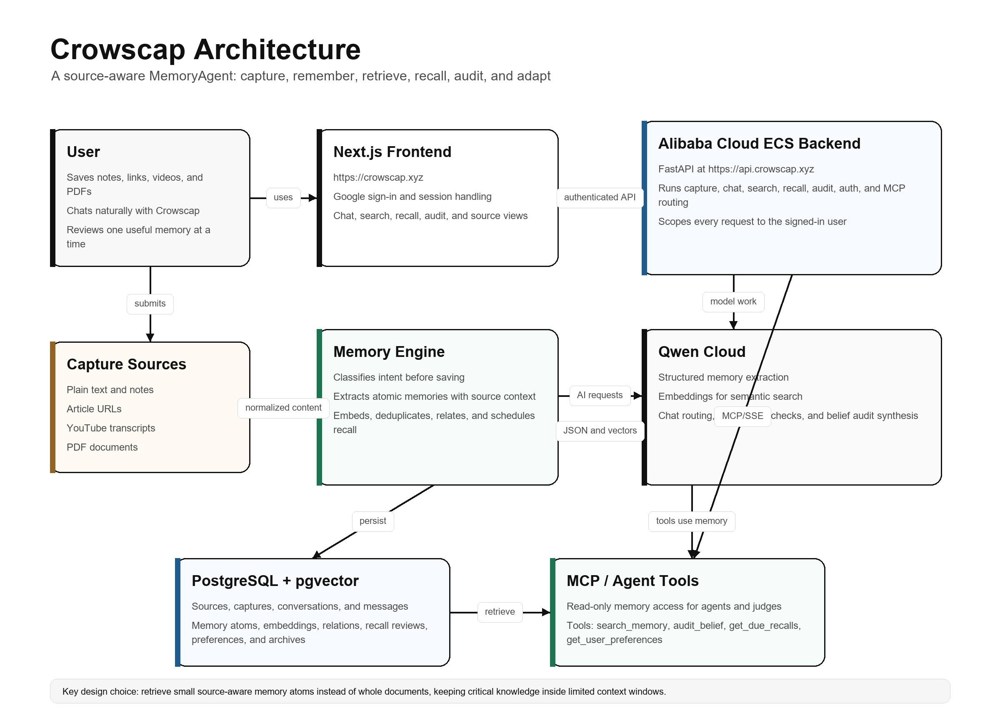

# Crowscap

> Turn what you save into knowledge you can remember, question, and use.

Crowscap is a conversational memory intelligence system built for the Qwen Cloud MemoryAgent track. It helps people turn scattered learning fragments into source-aware memory that can be searched, recalled, audited, and improved over time.

Most tools help people store information. Crowscap is built for the harder problem: helping saved information become usable knowledge.

## Live Project

- Frontend: https://crowscap.xyz
- Backend health check: https://api.crowscap.xyz/api/v1/health
- MCP SSE endpoint: https://api.crowscap.xyz/mcp/sse

The MCP SSE endpoint is a long-running stream. A successful quick check returns an `event: endpoint` line and then keeps the connection open.

## Hackathon Track

Track 1: MemoryAgent.

The project demonstrates:

- Persistent memory across sessions.
- User preference learning.
- Efficient storage and retrieval.
- Timely forgetting through archive and deprioritization.
- Recall of critical memories within limited context windows.
- Agent-accessible memory tools through MCP/SSE.

## Why Crowscap Exists

People save more than they can integrate. Links stay unread. Notes lose context. Videos become vague memories. Advice gets repeated without being applied. Familiar ideas start to feel true simply because they are familiar.

Crowscap treats memory as a lifecycle, not a folder:

```text
Capture -> Extract -> Structure -> Relate -> Recall -> Audit -> Adapt
```

The system does not try to be a truth oracle. It keeps source context, confidence, uncertainty, and user intent visible. A saved claim is not automatically treated as the user's belief. A public source is not automatically treated as final truth. Crowscap helps the user notice what may need stronger evidence, what may depend on context, and what may be worth revisiting.

## What It Does

Crowscap supports:

- Chat-first capture of notes, ideas, links, YouTube videos, and PDFs.
- Atomic memory extraction with Qwen Cloud structured output.
- Semantic search with Qwen embeddings and PostgreSQL vector support.
- Source preservation so users can view the original saved material.
- Relationship detection between memories, such as agreement, conflict, qualification, or added context.
- Recall scheduling and review scoring.
- Reminder-only nudges that do not pollute long-term knowledge memory.
- Belief audits that synthesize what saved memories appear to say about a topic.
- Preference learning from explicit instructions and lower-confidence behavior signals.
- User-controlled archiving so unwanted memories stop surfacing.
- Read-only MCP tools for agent access.

## Architecture



The architecture is intentionally split into three layers:

1. The frontend owns the product experience: chat, search, recall, audit, source views, and authentication.
2. The backend owns memory behavior: routing, extraction, embeddings, recall, audits, preferences, and guardrails.
3. Qwen Cloud powers language understanding, structured extraction, embeddings, relationship checks, and synthesis.

The main design choice is to retrieve small source-aware memory atoms instead of whole documents. This keeps the model context lean and helps Crowscap recall the right knowledge within limited context windows.

## Alibaba Cloud and Qwen Cloud Usage

The backend is deployed on Alibaba Cloud ECS and served through:

```text
https://api.crowscap.xyz
```

Qwen Cloud is used through its OpenAI-compatible API for:

- JSON-mode structured memory extraction.
- Chat and intent routing.
- Embeddings with `text-embedding-v4`.
- Relationship classification.
- Recall evaluation.
- Belief audit synthesis.

Primary proof file for Alibaba/Qwen Cloud API usage:

- [`backend/app/ai/qwen_client.py`](backend/app/ai/qwen_client.py)

Deployment and MCP notes:

- [`docs/14-alibaba-ecs-deployment.md`](docs/14-alibaba-ecs-deployment.md)
- [`docs/16-ecs-mcp-deployment.md`](docs/16-ecs-mcp-deployment.md)

## Repository Layout

```text
crowscap/
  backend/     FastAPI API, memory engine, database models, MCP server
  frontend/    Next.js chat-first product interface
  docs/        Product, architecture, API, deployment, and evaluation notes
  infra/       Deployment and infrastructure support files
```

## Core Backend Stack

- FastAPI
- Pydantic v2
- SQLAlchemy 2.x
- Alembic
- PostgreSQL with vector support
- Qwen Cloud OpenAI-compatible SDK
- MCP over SSE

## Core Frontend Stack

- Next.js
- TypeScript
- Tailwind CSS
- TanStack Query
- NextAuth with Google sign-in

## Local Development

Backend:

```powershell
cd backend
python -m venv .venv
.\.venv\Scripts\Activate.ps1
python -m pip install -e ".[dev]"
Copy-Item .env.example .env
python scripts/init_db.py
python scripts/run_dev.py
```

Frontend:

```powershell
cd frontend
npm install
npm run dev
```

Local app:

```text
http://127.0.0.1:3000
```

Local API docs:

```text
http://127.0.0.1:8000/docs
```

## Testing

Backend tests:

```powershell
cd backend
.\.venv\Scripts\python -m pytest
```

Backend syntax check:

```powershell
.\.venv\Scripts\python -m compileall app
```

Frontend production build:

```powershell
cd frontend
npm run build
```

## Documentation

Important project docs:

- [`docs/01-product-brief.md`](docs/01-product-brief.md)
- [`docs/03-system-architecture.md`](docs/03-system-architecture.md)
- [`docs/06-memory-engine.md`](docs/06-memory-engine.md)
- [`docs/08-data-model.md`](docs/08-data-model.md)
- [`docs/09-api-contract.md`](docs/09-api-contract.md)
- [`docs/10-security-cost-reliability.md`](docs/10-security-cost-reliability.md)
- [`docs/15-mcp-contract.md`](docs/15-mcp-contract.md)
- [`docs/17-auth-and-user-isolation.md`](docs/17-auth-and-user-isolation.md)
- [`docs/18-autonomous-preferences-and-perspectives.md`](docs/18-autonomous-preferences-and-perspectives.md)
- [`docs/19-chat-routing-and-trust.md`](docs/19-chat-routing-and-trust.md)

## Current Scope

Crowscap is a hackathon MVP with production-minded foundations. It is not a finished consumer product yet. The strongest implemented loop is:

```text
Save a source -> extract memory atoms -> search and recall them -> audit beliefs -> adapt to the user
```

The next major layers are stronger background processing, richer proactive perspective notes, better notification delivery, and broader MCP write tools after the read-only contract is stable.
